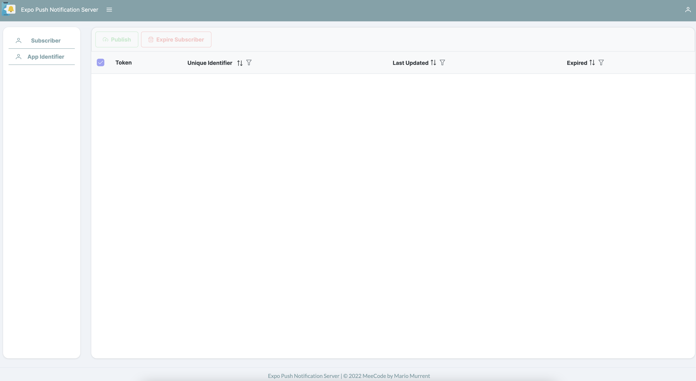

# Expo Push Notification Server with Angular PrimeNG UI

<p align="center">
  
  
</p>

## General

### Default user

When the backend is started a default user is created with the credentials specified in the `database-configuration.json` file

### Creating an app identifier

Start with creating an app identifier in the Expo Push Notification Server UI.
An app identifier is needed for subscriber to register and for the user to specify for which subscriber the push notifications should be sent out.

### Registering a subscriber

A client (using the Expo SDK) can register as subscriber.

To register a subscriber send a request to the `subcriber/create` endpoint with the following payload:

```javascript
{
  token: "expo-push-notification-token",
  appIdentifierId: "your-app-identifier"
}
```

#### Token:

The expo push notification token received via:

`Notifications.getExpoPushTokenAsync({ experienceId: experienceId })).data;`

#### appIdentifierId

The app identifier created via the Expo Push Notification Server UI

### Expo Util Example

See [Expo App Notification Example](examples/expo-snippet/NOTIFICATION.md) for a full example.
After successful registration of a subscriber you should see the subscriber in the list on the Expo Push Notification Server UI.

### Sending push notifications

Push notifications can be sent to selected or all subscribers. 
Therefore, you need to log in to the Expo Push Notification Server UI.

## Server

NodeJS Typescript server based on [expressJS](https://expressjs.com/)

### Requirements

- Existing [RethinkDB](https://rethinkdb.com/docs/install/)

### Installing dependencies

`npm install`

### Starting the server

`npm run start`

## Frontend

Angular Frontend

### Installing dependencies

`npm install`

### Starting the frontend

`ng serve`

### Running via Docker

You can use the DockerFile to create a Docker image for the Expo Push Notification Server which includes both the server and the UI.

- Run `npm run build` in the `client` directory. This command will build the frontend and copy the generated build into the `public` folder.
- Run `npm run docker-build` from the root directory to build the docker image
- Run `npm run docker-run-server` from the root directory to start the container

## ToDos

See [TODO.md](TODO.md) for more information

## Contribute

Feel free to contribute, either via opening an Issue on GitHub or actively join the development.
This project is by far not finished and there are a lot of things to do.

## Git Commit Message Convention

Please follow the conventional commits specification

[](https://conventionalcommits.org)

## License

See [LICENSE.md](LICENSE.md) for more information

### Icons

App Icon from [Smashicons](https://www.flaticon.com/authors/smashicons)
